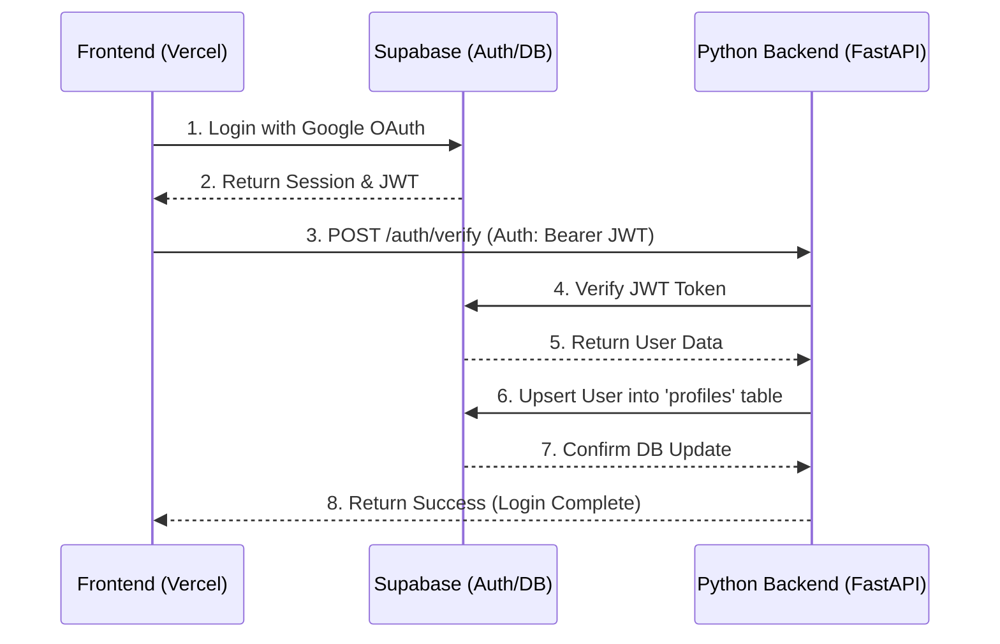

# Backend API Documentation (FastAPI + Supabase)

This document provides a complete overview of the backend integration, database schema, and instructions for the frontend developer.

## 1. Project Architecture
The following diagram shows how the Frontend, Backend, and Supabase interact during the authentication and data synchronization flow:



---

## 2. API Endpoints
### Base URL
- **Local Dev:** `http://localhost:8000`
- **Production:** `[Your Deployed Backend URL]`

### User Verification & Sync
**Endpoint:** `/auth/verify`  
**Method:** `POST`

This endpoint should be called immediately after a user successfully logs in via Google/Supabase on the frontend. It verifies the session and ensures the user has a record in the `profiles` database table.

### Headers
| Key | Value | Description |
| :--- | :--- | :--- |
| `Authorization` | `Bearer <SUPABASE_JWT>` | The `access_token` provided by Supabase after login. |

### Request Body
None Required.

### Sample JavaScript Integration (Fetch)
```javascript
const { data, error } = await supabase.auth.signInWithOAuth({
  provider: 'google',
})

// After successful login, get the session
const { data: { session } } = await supabase.auth.getSession();

if (session) {
  const response = await fetch('http://localhost:8000/auth/verify', {
    method: 'POST',
    headers: {
      'Authorization': `Bearer ${session.access_token}`,
      'Content-Type': 'application/json'
    }
  });
  
  const result = await response.json();
  console.log('Backend Sync Result:', result);
}
```

### Success Response (`200 OK`)
```json
{
  "status": "success",
  "message": "User verified and profile synchronized",
  "user": {
    "id": "uuid-goes-here",
    "email": "user@gmail.com",
    "full_name": "John Doe"
  }
}
```

### Error Responses
| Status Code | Detail | Cause |
| :--- | :--- | :--- |
| `401` | `Missing Authorization Header` | No Bearer token was sent. |
| `401` | `Invalid or expired token` | The JWT is malformed or has expired. |
| `401` | `Authentication failed: ...` | Supabase rejected the verification request. |

---

## 2. Database Schema (Profiles Table)
The backend automatically syncs the following fields into the `profiles` table. You can query this table directly using the Supabase client if needed:

- `id` (UUID, Primary Key)
- `full_name` (Text)
- `email` (Text)
- `avatar_url` (Text)
- `updated_at` (Timestamp)

---

## Important Notes
- **CORS:** The backend is currently configured to allow all origins (`*`).
- **Token Handling:** Always send the `access_token` (JWT), not the `refresh_token`.
